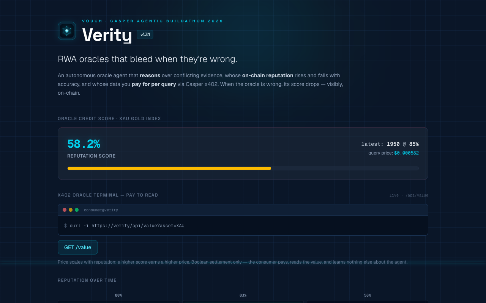
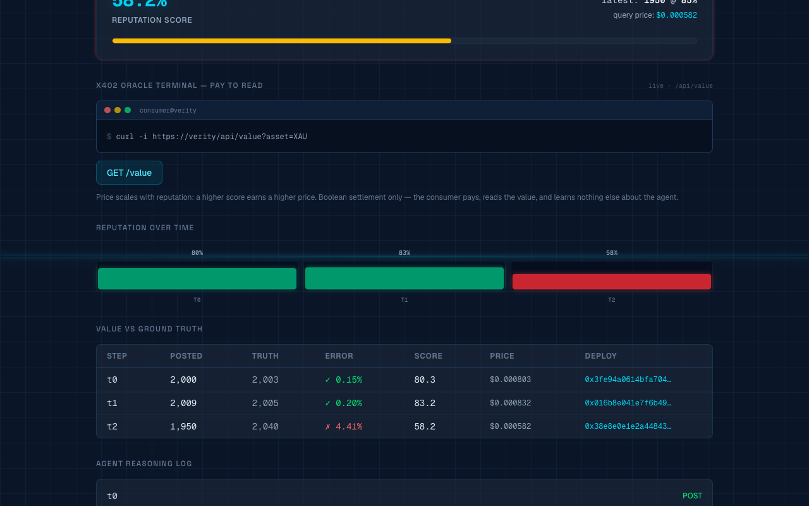
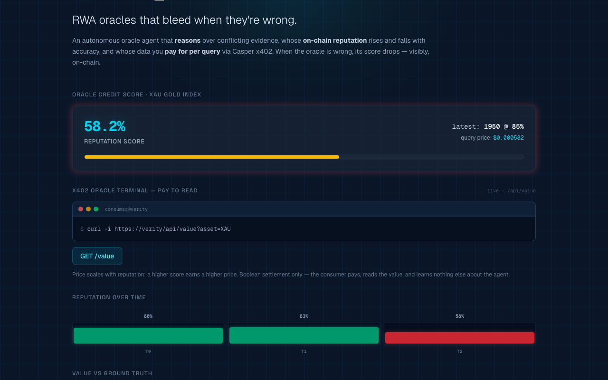
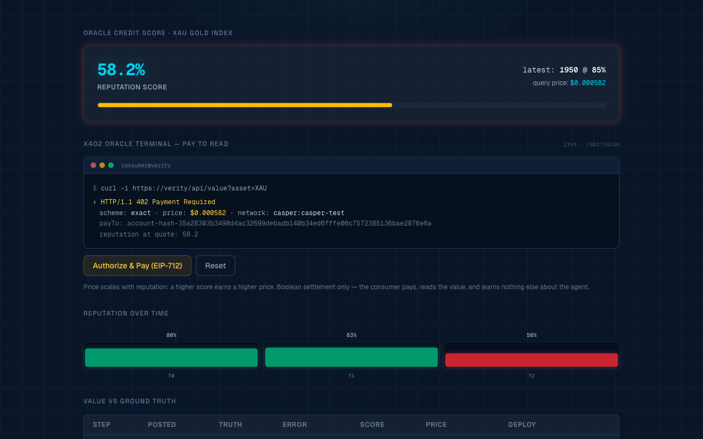
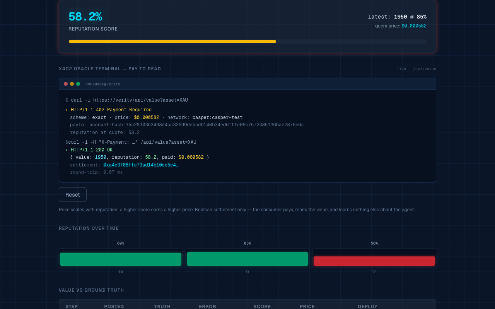
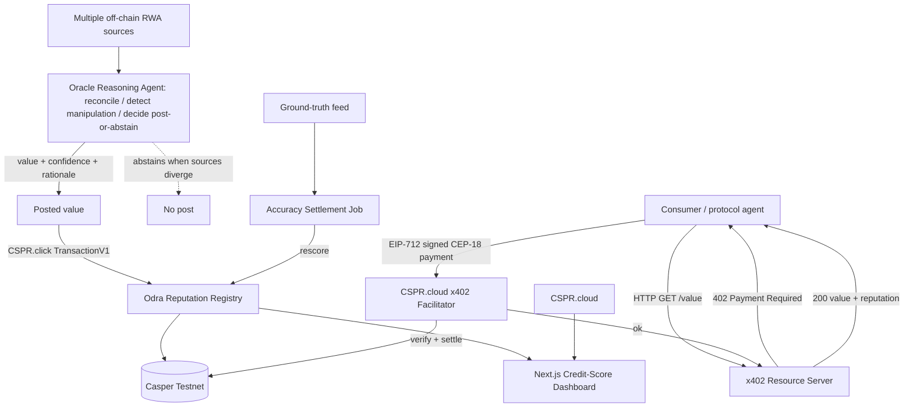

<div align="center">
  
  <h1>Verity 🎯</h1>
  <p><em>RWA oracles that bleed when they're wrong.</em></p>
  

  <br/>

  [](https://verity.edycu.dev)
  [](https://verity.edycu.dev/pitch.html)
  [](https://youtu.be/ZHmBlNZ2Eeo)
  [](https://dorahacks.io/hackathon/casper-agentic-buildathon)

  <br/>
  
  
  
  [](https://github.com/edycutjong/verity/tree/main/contract)
  [](https://github.com/edycutjong/verity)
  
  [](https://opensource.org/licenses/MIT)
  [](https://github.com/edycutjong/verity/actions/workflows/ci.yml)

</div>

---

## 📸 See it in Action

> **Autonomous RWA oracle agent that reasons over conflicting evidence, whose on-chain reputation rises and falls with its accuracy, and whose data you pay for per query via Casper x402. One of three coordinated Casper agent-trust projects.**

### 1. Reputation & Value Dashboard
<div align="center">
  
</div>

*The main Verity interface tracking real-world asset listings (Gold, Silver, Copper) alongside the oracle agent's live on-chain EWMA reputation score.*

### 2. Multi-Source AI Reasoning Logs
<div align="center">
  
</div>

*The reasoning console showing how the oracle agent ingests and compares data from multiple feeds (Bloomberg, Reuters, Binance), detects anomalies, and reconciles them before posting.*

### 3. Pay-to-Read Oracle Terminal (x402 Micropayments)
<div align="center">
  
</div>

*The consumer-facing Oracle Terminal, where protocols can query the oracle feed.*

### 4. Casper x402 Payment Challenge
<div align="center">
  
</div>

*Querying the endpoint triggers a 402 Payment Required challenge, requiring the requester to pay a dynamically-scaled fee proportional to the oracle's reputation.*

### 5. Decrypted Value Egress
<div align="center">
  
</div>

*Upon signing and settling the EIP-712 payment authorization, the facilitator approves the request, returning the decrypted asset values.*

---

## 💡 The Problem & Solution
Standard oracles face no real penalty for delivering bad data; their trust assumptions are static.
**Verity** solves this by establishing an EWMA-based on-chain scoring system where when the oracle is wrong, its score drops — visibly, on-chain.

**Key Features:**
- ⚡ **Autonomous Reasoning:** Analyzes conflicting evidence using AI to arrive at a verified consensus.
- 🔒 **On-Chain Reputation:** Accuracy directly translates into an EWMA-based score (0-10000 basis points) on the Casper Testnet.
- 🎨 **Micropayments (x402):** Data is monetized per query using Casper x402, with query price dynamically scaling with reputation.
- 🖥️ **Oracle Terminal:** Click through the live x402 pay-to-read round-trip (`402` → EIP-712 authorization → `200 { value, reputation }`) against the running `/api/value` endpoint.

## 🏗️ Architecture & Tech Stack

| Layer | Technology |
|---|---|
| **Frontend** | Next.js 16 (App Router), React 19, Tailwind CSS v4 |
| **Contract** | Odra (Rust) on Casper Testnet |
| **Reputation** | EWMA-based on-chain scoring (α = 0.3, max 2% miss threshold) |
| **Micropayments** | x402 (CSPR.cloud facilitator) |
| **Signing** | CSPR.click AI Agent Skill |
| **Testing** | Vitest |

### System Data Flow



> 🔍 **Deep Dive:** For a full architectural breakdown, including specific API endpoints, the EWMA scoring formulas, and x402 payment flow verification details, see the detailed [System Architecture Design Document](docs/ARCHITECTURE.md).

## 🏆 Sponsor Tracks Targeted & Code References

*   **Casper Innovation Track (Build Direction #3: AI-Powered Oracle Networks)**
    *   **Casper Testnet Smart Contract:** Built with the Odra framework in Rust, located in [verity.rs](contract/src/verity.rs). Tracks oracle reputation records on-chain and processes settlements.
    *   **Casper x402 Micropayments:** Integrated in [x402.ts](src/core/x402.ts) to verify query payment tokens.
    *   **CSPR.click / Agent Signing:** Handles secure key pair signatures and deploy dispatches to the Casper Network, structured in [casper.ts](src/lib/casper.ts).

## 🚀 Getting Started

### Prerequisites
- Node.js ≥ 20
- npm
- Rust & cargo-odra (for contract builds)

### Installation
1. Clone: `git clone https://github.com/edycutjong/verity.git`
2. Change directory: `cd verity`
3. Install: `npm install`
4. Configure: `cp .env.example .env.local` and add your keys
5. Run: `npm run dev`

> 💡 **Note for Judges:**
> Verity operates in **Demo Mode** by default. This mocks the x402 token verification flow and uses deterministic mock agents, allowing you to explore the full credit-bureau reputation oracle lifecycle and query dispatches instantly without configuring keys or funded test wallets.

## ⛓️ Live Testnet Deployment

> All contracts are **live on Casper Testnet** (chain `casper-test`). Set `VERITY_DEMO=false` + fill `.env.local` to broadcast real `post_value` / `settle` transactions and use the real x402 facilitator.

| Item | Value |
|---|---|
| **Verity Contract** | [`hash-657a83911a36b3aa2204e47f39c237f15b2ed6f54cbaf6f83b0be7f1d7873c82`](https://testnet.cspr.live/contract-package/657a83911a36b3aa2204e47f39c237f15b2ed6f54cbaf6f83b0be7f1d7873c82) |
| **Install Transaction** | [`66b6f13ab163abf5265c4007d7438ee178bdbea682adab1c394a6f043765dcc1`](https://testnet.cspr.live/transaction/66b6f13ab163abf5265c4007d7438ee178bdbea682adab1c394a6f043765dcc1) |
| **`post_value` (oracle posts a value)** | [`fc10730db99724ee78bb8c55657fa29054268a61e4fb96b1e794e649cda66e0b`](https://testnet.cspr.live/transaction/fc10730db99724ee78bb8c55657fa29054268a61e4fb96b1e794e649cda66e0b) |
| **`settle` (EWMA reputation drops 83.2→58.2 on a MISS)** | [`ce35dd60774149baa8564e5adc0adbedd1ec624157103666e2615beaa615be21`](https://testnet.cspr.live/transaction/ce35dd60774149baa8564e5adc0adbedd1ec624157103666e2615beaa615be21) |
| **CEP-18 Token (x402)** | [`hash-541069ed8cad06249f76edb0972932d012badbb256111d3000df06ac1d703be6`](https://testnet.cspr.live/contract-package/541069ed8cad06249f76edb0972932d012badbb256111d3000df06ac1d703be6) |
| **Oracle Account** | [`016bfd43f7d73c988702e0b1e8657687282bc578b60e9eaaabb1f3aa95ff9a7338`](https://testnet.cspr.live/account/016bfd43f7d73c988702e0b1e8657687282bc578b60e9eaaabb1f3aa95ff9a7338) |
| **Network** | Casper Testnet (`casper-test`) |
| **Framework** | Odra (Rust → WASM, `target-cpu=mvp`) |
| **Machine-readable record** | [`deployments/testnet.json`](deployments/testnet.json) |

> **Re-deploy your own:** `npm run deploy:rpc` installs a fresh contract instance and prints the package hash. See [LIVE_TESTNET.md](LIVE_TESTNET.md) for the full walkthrough.

> _Originality: all code is original and newly developed for the Casper Agentic Buildathon 2026; shared `@vouch/*` packages are authored for this submission._

## 📖 Documentation & Design Resources

The following design documents and resources are available in this repository:
*   🏗️ **[System Architecture](docs/ARCHITECTURE.md):** Full data flow diagrams (Mermaid), API specifications, and math/cryptographic models.
*   🎬 **[Interactive Demo Guide](docs/DEMO.md):** Step-by-step walkthrough of the live demo console and expected system behaviors.
*   🛡️ **[Sponsor Track Defense](docs/SPONSOR_DEFENSE.md):** Justification of track eligibility, including Casper Network and x402 integration references.
*   📋 **[Product Requirements Document (PRD)](docs/PRD.md):** Initial project scope, problem statement, user personas, and product requirements.
*   🚀 **[Live Testnet Wiring Runbook](LIVE_TESTNET.md):** Detailed guide to flipping the application from demo mode to Casper Testnet execution.

## 🧪 Testing & CI

**6-stage pipeline:** Quality → Security → Build → E2E → Performance → Deploy

```bash
# ── Code Quality ────────────────────────────
npm run lint          # ESLint
npm run typecheck     # TypeScript check
npm run test          # Run Vitest tests
npm run test:coverage # Coverage report
npm run ci            # Full quality gate

# ── Advanced Testing ────────────────────────
npm run e2e           # Playwright E2E tests
npm run e2e:ui        # Playwright interactive mode
npm run lighthouse    # Lighthouse CI audit

# ── Security ────────────────────────────────
make security-scan    # npm audit + license check
```

| Layer | Tool | Status |
|---|---|---|
| Code Quality | ESLint + TypeScript | ✅ |
| Unit Testing | Vitest | ✅ |
| E2E Testing | Playwright (2 suites) | ✅ |
| Security (SAST) | CodeQL | ✅ |
| Security (SCA) | Dependabot + npm audit | ✅ |
| Secret Scanning | TruffleHog | ✅ |
| Performance | Lighthouse CI | ✅ |

## 📄 License

This project is licensed under the [MIT License](LICENSE) — see the LICENSE file for details.

