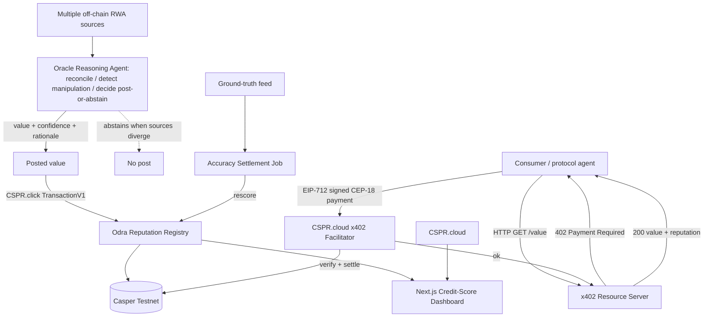

# Verity — Architecture

## Tech stack
- **Frontend:** Next.js + React + Tailwind/shadcn (the "oracle credit score" dashboard). Vercel.
- **Oracle agent:** Node/TypeScript worker — multi-source ingest → **LLM reasoning** (reconcile sources, detect manipulation/staleness, decide post-or-abstain) → calibrated confidence → CSPR.click post. Reasoning agent = Claude (`claude-opus-4-8` for the reconciliation/decision, with a deterministic numeric aggregator as a sanity check the LLM must justify deviating from).
- **x402 layer:** resource server + client built against the **CSPR.cloud x402 facilitator** REST endpoints; payment authorization via **casper-eip-712** (`signTypedData`, JS). **Go micro-service fallback** using `make-software/casper-x402` if the JS path stalls.
- **On-chain:** Odra reputation registry on Casper **Testnet**.
- **Reads:** CSPR.cloud REST/streaming; Casper MCP for any contract-state checks.
- **State:** Supabase (value history, query receipts, ground-truth set).

## Why this modeling choice (agentic, but auditable)
- The **raw numbers** come from real sources (never invented by the LLM — that would be the unauditable "ask GPT for the price" black box Verity exists to replace). A **deterministic aggregator** computes a baseline.
- The **LLM agent reasons over the evidence**: which sources agree, which is an outlier, is one stale or manipulated, should we trust the baseline or deviate, and **is the disagreement large enough that we should abstain entirely?** It must produce a written rationale and may only deviate from the deterministic baseline with a justification — so the AI adds genuine judgment (manipulation resistance, abstention) without hallucinating prices.
- This is the meaningful agentic-autonomy the judges reward: perceive (multi-source) → reason (reconcile/detect) → decide (post or abstain) → act (sign+post) → be scored. A pure statistical estimator can't catch a single manipulated feed the way an agent reasoning over source provenance can.

## System architecture (Mermaid)

## The Odra reputation registry (minimal, Rust)
- `post_value(asset, value, confidence_bps, rationale_hash) -> post_id`
- `settle(post_id, ground_truth)` — compares, adjusts the agent's `reputation` (e.g., EWMA of accuracy), emits `Rescored`.
- `get_reputation(agent) -> score`, `get_value(asset) -> latest`, `get_post(post_id)`.
- Reputation is keyed to the agent's public key; settlement is the only writer of score.

## x402 flow (the risky, verified path)
1. Consumer `GET /value?asset=XAU` → server returns **402** with payment requirements (scheme `exact`, CEP-18 asset, price scaled by current reputation, network `casper:casper-test`).
2. Consumer signs an **EIP-712** typed-data authorization (casper-eip-712, JS) for the CEP-18 transfer + facilitator fee.
3. Server forwards the signed payload to the **CSPR.cloud facilitator** `/verify` then `/settle`; facilitator submits the on-chain payment.
4. On success, server returns **200** with the value + reputation + the settlement deploy hash.

## API endpoints
- `GET /value?asset=` — x402-gated read (the paid endpoint).
- `GET /reputation/:agent` — public score + history.
- `POST /internal/post` — agent posting loop (auth).
- `POST /internal/settle` — ground-truth settlement (auth/cron).
- `GET /health/x402` — facilitator reachability + supported schemes.

## Key libraries / SDKs
`casper-js-sdk` (CSPR.click), `casper-eip-712` (JS), CSPR.cloud x402 facilitator REST, Odra + `cargo-odra`, optional Go `make-software/casper-x402`, Next.js, Supabase.

## Boilerplate
`npx create-next-app`; scaffold contract with `cargo odra new`; reuse `@vouch/conclave-mcp-tools` from Conclave for CSPR.click posting (shared spine).
